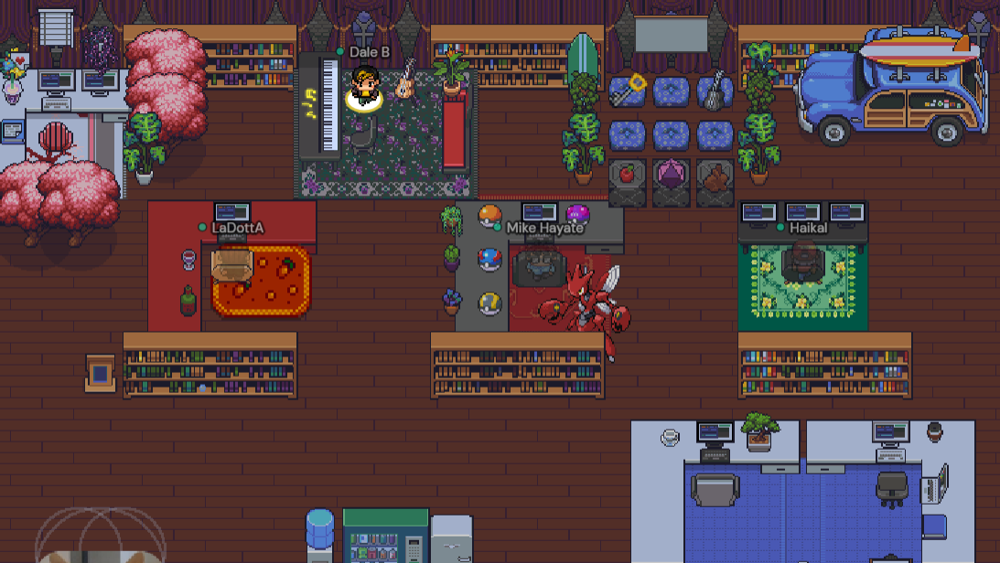
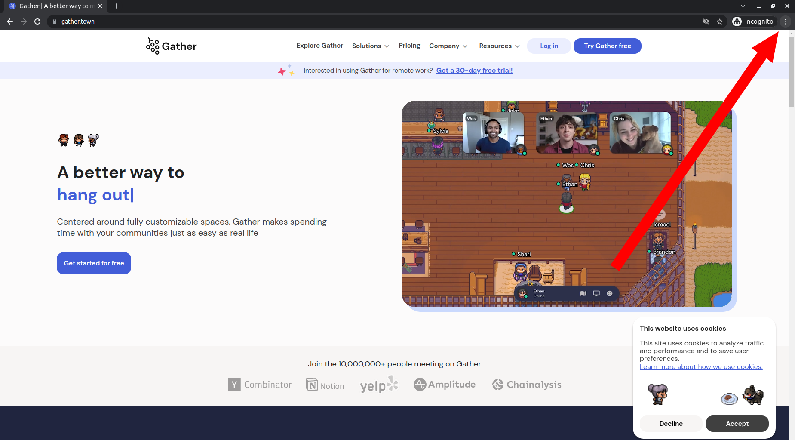
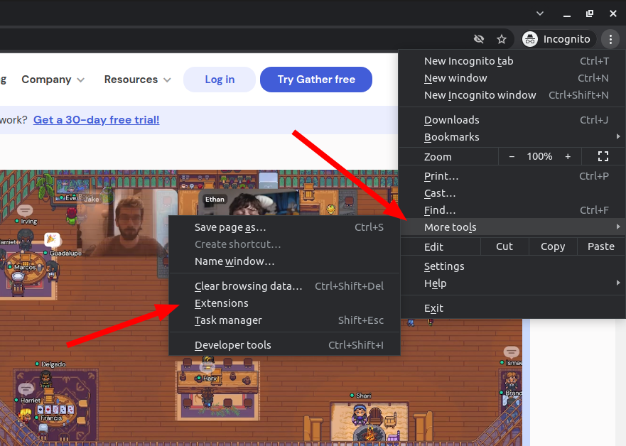
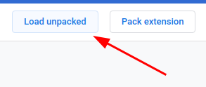
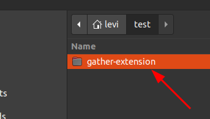

# Gather Extension

<p align="center">
  
</p>

---

## 🧾 About

**Gather Extension** is an extension wich was created to make a better UX when using Gather. It implements shortcuts to share your screen and enable/disable microphone and video.

---

## ⁉️ How to Use?

### Shortcuts

```
\ or , ➡️ Enable/Disable microphone
' or . ➡️ Enable/Disable video
/ or ; ➡️ Share screen
```

---

## 🔧 Tools

- Javascript

---

## 👨‍💻 How to Setup?

### Clone project to your computer

```bash
  # Clone the project
  $ git clone https://github.com/Levis44/gather-extension.git
  $ cd gather-extension
  $ code .
```

### Change matches links

Go to manifest.json

```json
{
  "manifest_version": 2,
  "name": "Gather Extension",
  "version": "1.0.0",
  "content_scripts": [
    {
      "matches": ["${your-gather-server-link}"],
      "js": ["main.js"]
    }
  ]
}
```

Change the matches property with your gather server link.

### Add Extension:

Click on "Customize and control google chrome".

<p align="center">
  
</p>

Go to More tools -> Extensions

<p align="center">
  
</p>

Activate Developer Tool

<p align="center">
  
</p>

Load Unpacked

<p align="center">
  
</p>

Choose your directory we cloned before. Check if does not exists other directories inside the cloned one.

<p align="center">
  
</p>

After all that, reload your Gather window and feel free to use the extension.

---

<p align="center">Done by Levi Bernardelli Ciarrocchi ✌🏼</p>
